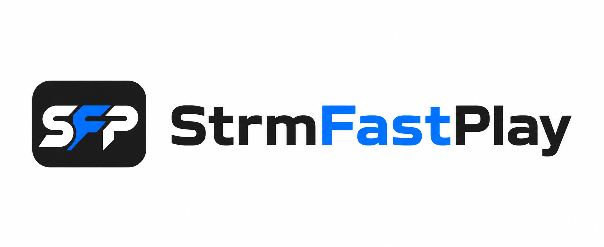

<p align="center">
  
</p>

# StrmFastPlay

StrmFastPlay 是 Jellyfin STRM 起播加速插件，支援各大網盤搭配 OpenList、AList 使用，縮短播放前等待時間，盡量達到秒播效果。

## 使用說明

- OpenList / AList 連接各網盤時，建議使用 302 直連模式；網頁內播放越快，Jellyfin STRM 就越容易達到秒播。若來源本身速度較慢或無法播放，插件也無法改善網盤來源的速度。
- 目前實測 PikPak 最為穩定，通常可在 5 秒內起播；其他網盤的起播時間會依來源當下的速度而有所不同。
- 劇集播放到 80% 時會預先準備下一集，縮短接續播放的等待時間。
- 為了正確預熱下一集，請將同一季的劇集放在同一目錄，並確認 Jellyfin 能正確辨識季數與集數順序。
- 影片使用內嵌軟字幕或外掛字幕時，需要額外載入字幕，因此起播速度通常會比硬字幕稍慢。
- 影片已燒入硬字幕時，不需要另外載入字幕；只要來源順暢，就更容易達到秒播效果。

## PikPak 邀請碼

使用 PikPak 時輸入邀請碼，可獲得額外會員天數。

**邀請碼：`34544273`**

## 下載

[前往 Releases 下載](https://github.com/SkillGodAk/StrmFastPlay/releases)

## 安裝

下載 Releases 裡的 `StrmFastPlay.zip`，將 ZIP 內的 DLL 與 `meta.json` 一起解壓縮並完整覆蓋到 Jellyfin 插件目錄：

```text
jellyfin/config/plugins/StrmFastPlay/
```

ZIP 內的 DLL 與 `meta.json` 兩個檔案都必須安裝。完成後請完整重新啟動 Jellyfin；Docker 使用者需重新啟動 Jellyfin 容器。

建議安裝完成後，前往「控制台 → 已排程的工作」，手動執行一次 StrmFastPlay 的「提取 STRM 媒體資訊」。

## 試用與價格

首次安裝可免費試用 7 天。試用結束後需輸入授權碼。

- 月卡：5 RMB / 台幣 25 元
- 半年卡：25 RMB / 台幣 125 元
- 年卡：50 RMB / 台幣 250 元

購買方式請聯絡作者：

- QQ 群：1018495751
- TG 群：[點此加入並聯絡作者](https://t.me/+l1v_7ag4mJQ3NjI1)
